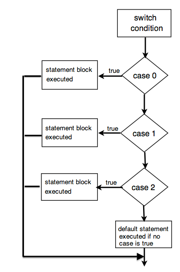

<section id="themes">
	<h2>Themes</h2>
		<p>
			Set your presentation theme: <br>
			<!-- Hacks to swap themes after the page has loaded. Not flexible and only intended for the reveal.js demo deck. -->
			<a href="#" onclick="document.getElementById('theme').setAttribute('href','css/theme/black.css'); return false;">Black (default)</a> -
			<a href="#" onclick="document.getElementById('theme').setAttribute('href','css/theme/white.css'); return false;">White</a> -
			<a href="#" onclick="document.getElementById('theme').setAttribute('href','css/theme/league.css'); return false;">League</a> -
			<a href="#" onclick="document.getElementById('theme').setAttribute('href','css/theme/sky.css'); return false;">Sky</a> -
			<a href="#" onclick="document.getElementById('theme').setAttribute('href','css/theme/beige.css'); return false;">Beige</a> -
			<a href="#" onclick="document.getElementById('theme').setAttribute('href','css/theme/simple.css'); return false;">Simple</a> <br>
			<a href="#" onclick="document.getElementById('theme').setAttribute('href','css/theme/serif.css'); return false;">Serif</a> -
			<a href="#" onclick="document.getElementById('theme').setAttribute('href','css/theme/night.css'); return false;">Night</a> -
			<a href="#" onclick="document.getElementById('theme').setAttribute('href','css/theme/moon.css'); return false;">Moon</a> -
			<a href="#" onclick="document.getElementById('theme').setAttribute('href','css/theme/solarized.css'); return false;">Solarized</a>
		</p>
</section>

H:

# Structured programming overview

by some [National University of Colombia collaborators](https://github.com/orgs/objetos/people)

H:

# Index

 1. Introduction: Program paradigms <!-- .element: class="fragment" data-fragment-index="1"-->
 1. Structured programming elements <!-- .element: class="fragment" data-fragment-index="2"-->
 1. Basic data structures <!-- .element: class="fragment" data-fragment-index="3"-->
 
H:

## Introduction

1. Program paradigms
1. Turing completeness

V:

## Introduction: Program paradigms

Computational paradigm <!-- .element: class="fragment" data-fragment-index="2"-->

Computing problem -> Programming -> Executable

Program paradigm -> Style of programming <!-- .element: class="fragment" data-fragment-index="1"-->

V:

## Introduction: Turing Machines

A [turing machine](https://en.wikipedia.org/wiki/Turing_machine) (TM[I,O]) is an 'abstract' machine such:

Input string (I) -> TM -> Output (O)

O: Output string & halts; or,
   Calculates forever <!-- .element: class="fragment" data-fragment-index="1"-->
            
You may think of a TM like a program <!-- .element: class="fragment" data-fragment-index="3"-->

V:

## Introduction: Universal Turing Machine

A [universal turing machine](https://en.wikipedia.org/wiki/Universal_Turing_machine) (UTM) is a TM' such that:

Input string (I') -> TM' -> Output (O')

where,

I': [TM, I] <!-- .element: class="fragment" data-fragment-index="1"-->

O': O <!-- .element: class="fragment" data-fragment-index="2"-->

for a any TM[I,O] <!-- .element: class="fragment" data-fragment-index="3"-->
            
You may think of a UTM like a computer <!-- .element: class="fragment" data-fragment-index="4"-->

V:

## Introduction: Turing completeness

A [programming language](https://en.wikipedia.org/wiki/Programming_language) (or a [cellular automaton](https://en.wikipedia.org/wiki/Cellular_automaton)) is said to be [Turing complete](https://en.wikipedia.org/wiki/Turing_completeness) (or "computationally universal") if it can be used to simulate any [Turing machine](https://en.wikipedia.org/wiki/Turing_machine)

V:

## Introduction: Program paradigms

> A fundamental style of computer programming, serving as a way of building the programs

V:

## Introduction: Program paradigms
### Machine code

A set of [instructions](https://en.wikipedia.org/wiki/Central_processing_unit) executed directly by a computer's [central processing unit (CPU)](https://en.wikipedia.org/wiki/Central_processing_unit)

Computer lowest-level programming language <!-- .element: class="fragment" data-fragment-index="1"-->

Turing complete <!-- .element: class="fragment" data-fragment-index="2"-->

N:

Verify machine code Turing completeness, by mapping [TM informal description](https://en.wikipedia.org/wiki/Turing_machine#Informal_description) and machine code 'instructions'

V:

## Introduction: Program paradigms
### Asembly language

Very strong (one-to-one) correspondence between the language and the [architecture's](https://en.wikipedia.org/wiki/Computer_architecture)
[machine code](https://en.wikipedia.org/wiki/Machine_code) [instructions](https://en.wikipedia.org/wiki/Instruction_set)

Provides little or no abstraction from machine code <!-- .element: class="fragment" data-fragment-index="1"-->

V:

## Introduction: Program paradigms
### Structured Programming (SP)

Langs that describe, the step-by-step _procedure_ that according to _a particular programmer's view_, should be followed to solve a specific problem

The efficacy and efficiency of any such solution are both therefore entirely subjective and highly dependent on that programmer's experience, inventiveness and ability <!-- .element: class="fragment" data-fragment-index="1"-->

V:

## Introduction: Program paradigms
### SP: features

<li class="fragment"> Turing completeness (see the [structured_program_theorem](https://en.wikipedia.org/wiki/Structured_program_theorem))

<li class="fragment"> Elements
  1. Control structures: assignments, selection and iteration
  2. Functions (subroutines, method, or procedure, etc)

<li class="fragment"> Data structures: (multi-dimensional) Arrays
  
V:

## Introduction: Program paradigms
### SP: examples

[COBOL](https://en.wikipedia.org/wiki/COBOL)

[FORTRAN](https://en.wikipedia.org/wiki/Fortran)

[C](https://en.wikipedia.org/wiki/C_(programming_language)

V:

## Introduction: Program paradigms
### Object Oriented Programming (OOP)

Langs that described programs as a group of mutually interactive _objects_

<li class="fragment"> An object is a _data structure_ for storing user-defined _attributes_ (data or fields)), and _methods_ to manipulate them

V:

## Introduction: Program paradigms
### OOP examples

[C++](https://en.wikipedia.org/wiki/C%2B%2B)

[C#](https://en.wikipedia.org/wiki/C_Sharp_(programming_language)

[Java](https://en.wikipedia.org/wiki/Java_(programming_language)

[Ruby](https://en.wikipedia.org/wiki/Ruby_(programming_language)

V:

## Other paradigms

[Declarative programming](https://en.wikipedia.org/wiki/Declarative_programming)

[Functional programming](https://en.wikipedia.org/wiki/Functional_programming)

[Logic programming](https://en.wikipedia.org/wiki/Logic_programming)

[Symbolic programming](https://en.wikipedia.org/wiki/Symbolic_programming)

Multi-paradigm <!-- .element: class="fragment" data-fragment-index="1"-->

H:

## Structured programming (SP) elements

<li class="fragment"> Control structures ([statements](https://en.wikipedia.org/wiki/Statement_(computer_science))
  1. Assignments
  2. Selection: simple and multiple choice
  3. Iteration

<li class="fragment"> Functions (subroutines, method, or procedure, etc)

V:

## SP elements: Assignments

What is?

> A process in imperative programming in which different values are associated with a particular variable name as time passes

V:

## SP elements: Assignments

In order to:

> The program, in such model, operates by changing its state using successive assignment statements

V:

## SP elements: Assignments

Pseudocode:

```java
x = expr
```

V:

## SP elements: Assignments

Examples:

```java
int x = 10; 
float y;
x = 23;
y = 32.4f;
```

V:

## SP elements: Assignments

<li class="fragment"> Augmented assignment: ```a = 2*a;``` can be written as: ```a *= 2;```
<li class="fragment"> Chained assignment: ```a = b = c = d = f = 5;```

V:

## SP elements: Simple choice

<figure>
    
    <figcaption><a href="https://en.wikipedia.org/wiki/Conditional_(computer_programming)">An "If-then-else" flowchart</a></figcaption>
</figure>

V:

## SP elements: Simple choice

by example the following [code](https://processing.org/reference/if.html):

```java
for (int i = 5; i < height; i += 5) {
  stroke(255);   // Set the color to white
  if (i < 35) {  // When 'i' is less than 35...
    stroke(0);   //...set the color to black
  }
  line(30, i, 80, i);
}
```

N:

Blocks ({}) is a section of code which is grouped together.
Blocks consist of one or more declarations and statements. 

V:

## SP elements: Simple choice

produces:

<div id='if_id'></div>

V:

## SP elements: Multiple choice

<figure>
    
    <figcaption>A switch flowchart</figcaption>
</figure>

V:

## SP elements: Multiple choice

For [example](https://processing.org/reference/switch.html):

```java
int num = 1;

switch(num) {
  case 0: 
    println("Zero");  // Does not execute
    break;
  case 1: 
    println("One");  // Prints "One"
    break;
}
```

V:

## SP elements: Multiple choice

second [example](https://processing.org/reference/switch.html):

```java
char letter = 'N';

switch(letter) {
  case 'A': 
    println("Alpha");  // Does not execute
    break;
  case 'B': 
    println("Bravo");  // Does not execute
    break;
  default:             // Default executes if the case labels
    println("None");   // don't match the switch parameter
    break;
}
```

V:

## SP elements: Multiple choice

third [example](https://processing.org/reference/switch.html):

```java
// Removing a "break" enables testing
// for more than one value at once

char letter = 'b';

switch(letter) {
  case 'a':
  case 'A': 
    println("Alpha");  // Does not execute
    break;
  case 'b':
  case 'B': 
    println("Bravo");  // Prints "Bravo"
    break;
}
```

V:

## SP elements: For loops

```java
for (INITIALIZATION; CONDITION; AFTERTHOUGHT) 
{
    // Code for the for-loop's body goes here.
}
```

V:

## SP elements: For loops

The following [code](https://processing.org/reference/for.html):

```java
for (int i = 0; i < 80; i = i+5) {
  line(30, i, 80, i);
}
```

V:

## SP elements: For loops

produces:

<div id='for_id'></div>

V:

## SP elements: For loops

The following [code](https://processing.org/reference/curlybraces.html):

```java
int[] a = { 5, 20, 25, 45, 70 };

void setup() {
  size(100, 100);
}

void draw() {
  for (int i=0; i < a.length; i++) {
    line(0, a[i], 50, a[i]);
  }
}
```

V:

## SP elements: For loops

produces:

<div id='curly_id'></div>

V:

## SP elements: While loops

<figure>
    
    <figcaption><a href="https://en.wikipedia.org/wiki/While_loop">A while flowchart</a></figcaption>
</figure>

V:

## SP elements: While loops

```java
while (true) 
{
    //do complicated stuff
    if (someCondition) break;
    //more stuff
}
```

V:

## SP elements: While loops

The following [code](https://processing.org/reference/while.html):

```java
int i = 0;
while (i < 80) {
  line(30, i, 80, i);
  i = i + 5;
} 
```

V:

## SP elements: While loops

produces:

<div id='while_id'></div>

V:

## SP elements: Functions

> A sequence of program instructions that perform a specific task, packaged as a unit

This unit can then be used in programs wherever that particular task should be performed <!-- .element: class="fragment" data-fragment-index="1"-->

Subprograms may be defined within programs, or separately in libraries that can be used by multiple programs <!-- .element: class="fragment" data-fragment-index="2"-->

V:

## SP elements: Functions
### Features

<li class="fragment"> Decomposing a complex programming task into simpler steps
<li class="fragment"> Enabling reuse of code across multiple programs
<li class="fragment"> Dividing a large programming task among various programmers, or various stages of a project
<li class="fragment"> Hiding implementation details from users of the subroutine
<li class="fragment"> Improving traceability

V:

## SP elements: Functions
### Conventions for passing arguments

|     Convention    |                           Description                           |
|:-----------------:|:---------------------------------------------------------------:|
| Call by value     | Argument is evaluated and copy of value is passed to subroutine |
| Call by reference | Reference to argument, typically its address is passed          |

V:

## SP elements: Functions

The following:

```java
/*
Esta funcion retorna el n-simo termino de la serio de fibonacci
*/
int fibonacci(int n) {
  int x = 0, y = 1, z = 1;
  for (int i = 1; i < n; i++) {
    x = y;
    y = z;
    z = x + y;
  }
  return x;
}

int squares = 5;

void setup() {
  size(720,50);
  noLoop();
}

void draw() {
  background(255,0, 255);
  int w = width / squares;
  for(int i = 0; i < squares; i++) {
    fill(map(fibonacci(i+1), fibonacci(squares), 0, 0, 255));
    rect(i*w,0,w,50);
  }
}
```

V:

## SP elements: Functions

produces:

<div id='fibonacci_id'></div>

V:

## SP elements: Recursive functions

The following:

```java
/*
Esta funcion retorna el n-simo termino de la serio de fibonacci
*/
int fibonacci(int n) {
  // salida de la recursion
  if(n == 1)
    return 0;
  if(n == 2)
    return 1;
  // avance de la recursion:
  if( n > 2)
    return fibonacci(n-2) + fibonacci(n-1);
  // si n es negativo o 0
  return -1; 
}

int squares = 5;

void setup() {
  size(720,50);
  noLoop();
}

void draw() {
  background(255,0, 255);
  int w = width / squares;
  for(int i = 0; i < squares; i++) {
    fill(map(fibonacci(i+1), fibonacci(squares), 0, 0, 255));
    rect(i*w,0,w,50);
  }
}
```

V:

## SP elements: Recursive functions

produces:

<div id='recursion_id'></div>

H:

## Basic data structures: Arrays 1D

> An array is a container object that holds a fixed number of values of a single type

<figure>
    
</figure>

V:

## Basic data structures: Arrays 1D

The following [code](https://processing.org/examples/array.html):

```java
float[] coswave; 

void setup() {
  size(640, 360);
  coswave = new float[width];
  for (int i = 0; i < width; i++) {s
    float amount = map(i, 0, width, 0, PI);
    coswave[i] = abs(cos(amount));
  }
  background(255);
  noLoop();
}

void draw() {
  int y1 = 0;
  int y2 = height/3;
  for (int i = 0; i < width; i++) {
    stroke(coswave[i]*255);
    line(i, y1, i, y2);
  }

  y1 = y2;
  y2 = y1 + y1;
  for (int i = 0; i < width; i++) {
    stroke(coswave[i]*255 / 4);
    line(i, y1, i, y2);
  }
  
  y1 = y2;
  y2 = height;
  for (int i = 0; i < width; i++) {
    stroke(255 - coswave[i]*255);
    line(i, y1, i, y2);
  }
  
}
```

V:

## Basic data structures: Arrays 1D

produces:

<div id='array_id'></div>

V:

## Basic data structures: Arrays 2D

> A multi-dimensional array is an array of array

V:

## Basic data structures: Arrays 2D

<figure>
    
</figure>

V:

## Basic data structures: Arrays 2D

The following [code](https://www.processing.org/examples/array2d.html):

```java
float[][] distances;
float maxDistance;
int spacer;

void setup() {
  size(640, 360);
  maxDistance = dist(width/2, height/2, width, height);
  distances = new float[width][height];
  for (int y = 0; y < height; y++) {
    for (int x = 0; x < width; x++) {
      float distance = dist(width/2, height/2, x, y);
      distances[x][y] = distance/maxDistance * 255;
    }
  }
  spacer = 10;
  strokeWeight(6);
  noLoop();  // Run once and stop
}

void draw() {
  background(0);
  // This embedded loop skips over values in the arrays based on
  // the spacer variable, so there are more values in the array
  // than are drawn here. Change the value of the spacer variable
  // to change the density of the points
  for (int y = 0; y < height; y += spacer) {
    for (int x = 0; x < width; x += spacer) {
      stroke(distances[x][y]);
      point(x + spacer/2, y + spacer/2);
    }
  }
}
```

V:

### Basic data structures: Arrays 2D

produces:

<div id='array2d_id'></div>

V:

### Basic data structures: Dynamic Arrays

Pending

The [wikipedia article](https://en.wikipedia.org/wiki/Dynamic_array) is a good introductory reading

The Processing [ArrayList](https://processing.org/reference/ArrayList.html) is a good implementation example

H:

## References

Language theory
* [Introduction to automata theory, languages, and computation](http://cds.cern.ch/record/1610228)
Stack-overflow
* [Can all iterative algorithms be expressed recursively?](http://stackoverflow.com/questions/2093618/can-all-iterative-algorithms-be-expressed-recursively)
* [Can every recursion be converted into iteration?](http://stackoverflow.com/questions/931762/can-every-recursion-be-converted-into-iteration)
Wikipedia
* [Turing completeness](https://en.wikipedia.org/wiki/Turing_completeness)
* [Programming paradigm](https://en.wikipedia.org/wiki/Programming_paradigm)
* [Structured programming](https://en.wikipedia.org/wiki/Structured_programming)
Processing
* [API](https://processing.org/reference/)
* [P5.js](http://p5js.org/)